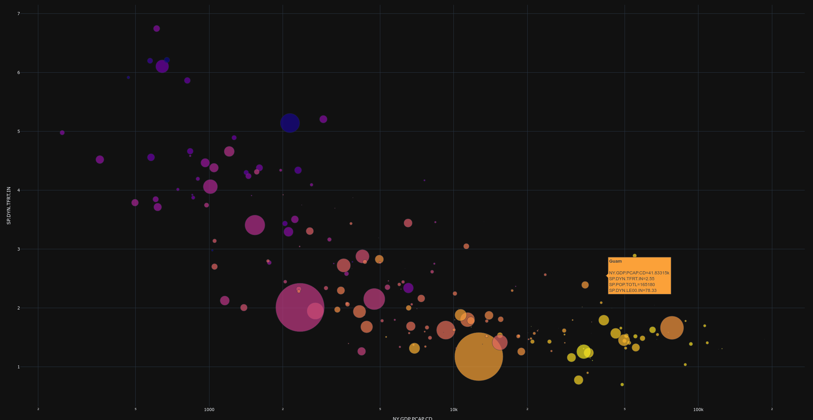

# Plotly Graphs

I finally got around to reworking my [wb-countries](project), this time in plotly. This time it is compatible with javascript, independent of pre-cleaned source files, and indicator codes can be swapped without breaking anything.

## running
```bash
git clone git@github.com:igfe/wb-countries.git
python3.12 -m venv venv
source venv/bin/activate
pip install -r requirements.txt
python plot.py
```

## features
- **cache decorator** - save/read API calls to csv if the same query is made many times (see [utils.py](./utils.py))

## output
This program plots an interactive graph of key economic indicators. It is currently hardcoded such that
- **x axis** - gdp per capita
- **y axis** - total fertility rate
- **size** - population
- **color** - life expectancy

Example ouput is given below:


[View interactive graph](https://ignaz.io/data/world_bank/)

Hovering over any of the datapoints will display information as in the **guam** example.

## TODO
- make dash app to select a variety of indicators
- intelligently scale axes based on distribution
- local cache a dictionary to display indicator name instead of chaos codes
- add to my website
